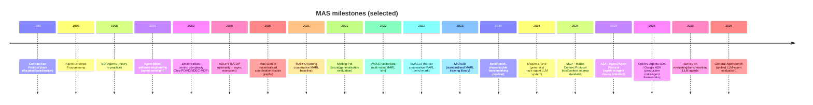

# Awesome Multi-Agent Systems

[](https://awesome.re)


A curated, **annotated** list of resources for the Multi-Agent Systems (MAS) research community—spanning **classic milestone work** and **recent advances (2021–2026)** across coordination, game theory, negotiation, planning, multi-agent learning, robotics, and simulation.

*Star counts below are **live badges** pulled from GitHub in real time via [shields.io](https://shields.io/).*

## Executive summary

Multi-Agent Systems research sits at the intersection of **(i) decision-making**, **(ii) interaction** (cooperation/competition/negotiation), and **(iii) evaluation** in realistic multi-entity environments (games, markets, robots, social settings). This README is designed to help you:
- Build **foundational literacy** (agent models, architectures, coordination, decentralised decision-making, DCOPs, negotiation).
- Track **high-impact modern directions** (benchmarking + reproducibility in MARL; scalable simulators; and LLM-based multi-agent "agentic systems" and evaluation).
- Choose **tools responsibly** (licensing, maturity signals like release activity/archival status, community adoption).

If any detail below is not reliably available from primary/official sources at authoring time, it is explicitly marked **unspecified**.

## Table of contents

- [How this repo is organised](#how-this-repo-is-organised)
- [MAS taxonomy and milestone timeline](#mas-taxonomy-and-milestone-timeline)
- [Curated resources](#curated-resources)
  - [Classic books (pre-2024)](#classic-books-pre-2024)
  - [Recent books (2024–)](#recent-books-2024)
  - [Tutorials and courses](#tutorials-and-courses)
  - [Tutorials and how-to guides](#tutorials-and-how-to-guides)
  - [Seminal papers and milestone work](#seminal-papers-and-milestone-work)
  - [Recent high-impact papers and surveys](#recent-high-impact-papers-and-surveys)
  - [Datasets and benchmarks](#datasets-and-benchmarks)
  - [Frameworks, libraries, and tools](#frameworks-libraries-and-tools)
  - [Competitions and challenges](#competitions-and-challenges)
  - [Agent interoperability protocols](#agent-interoperability-protocols)
- [Reproducibility and community](#reproducibility-and-community)
  - [Reproducibility resources and code](#reproducibility-resources-and-code)
  - [Community resources](#community-resources)
- [Contribution guidelines and curation criteria](#contribution-guidelines-and-curation-criteria)

## How this repo is organised

This repository treats MAS as a **family of research problems** rather than a single subfield. Resources are navigable via:
- **Topic tags** (e.g., `MARL`, `game-theory`, `negotiation`, `planning`, `robotics`, `simulation`, `DCOP`, `LLM-agents`).
- **Two-tier curation**:
  - **Milestones**: conceptual foundations and widely-cited "shape-of-the-field" work (often older).
  - **Recent**: last 5 years (2021–2026) emphasising robust benchmarks, reproducibility, and new agent paradigms (including LLM-based multi-agent evaluation and orchestration).

Entry format used in tables below:

```md
| Title | Authors/Maintainers | Year | Annotation | Link | Tags |
```

## MAS taxonomy and milestone timeline

### MAS topic taxonomy

```mermaid
graph TD
  MAS[Multi-Agent Systems] --> Models[Agent Models & Architectures]
  MAS --> Interaction[Interaction & Coordination]
  MAS --> Learning[Learning in Multi-Agent Settings]
  MAS --> Eval[Benchmarks, Evaluation, Reproducibility]
  MAS --> Simulation[Agent-Based Modelling & Simulation]

  Models --> BDI[BDI / deliberative agents]
  Models --> DecDP[Decentralised decision processes - Dec-POMDP/DEC-MDP]
  Interaction --> GameTheory[Game theory & mechanism design]
  Interaction --> Negotiation[Automated negotiation]
  Interaction --> DCOP[Distributed constraint optimisation - DCOP]
  Interaction --> MAPF[Multi-agent path finding]

  Learning --> MARL[Multi-Agent Reinforcement Learning]
  Learning --> Comm[Emergent communication / coordination learning]
  Learning --> LLM[LLM-based agents & multi-agent teams]

  MAS --> Protocols[Agent Interoperability Protocols]
  Protocols --> ToolProto[Tool/context protocols - MCP]
  Protocols --> A2AProto[Agent-to-agent protocols - A2A]
  Protocols --> UIProto[Agent-to-user protocols - AG-UI]

  Eval --> Bench[Benchmarks & task suites]
  Eval --> Artifacts[Artifacts, checklists, code release norms]
  Simulation --> ABM[ABM toolchains - social/eco/epi]
  Simulation --> RoboticsSim[Robotics-focused multi-agent simulation]
```



### Milestone timeline



## Curated resources

### Classic books (pre-2024)

| Title | Authors/Maintainers | Year | Annotation | Link | Tags |
|---|---:|---:|---|---|---|
| *An Introduction to MultiAgent Systems* (2nd ed.) | Michael Wooldridge | 2009 | A widely used MAS textbook covering agent concepts, interaction, coordination, and foundational theory; a solid "first principles" entry point for the broader MAS canon beyond MARL. | [Wiley page](https://www.wiley.com/en-us/An+Introduction+to+MultiAgent+Systems%2C+2nd+Edition-p-9780470519462) | `foundations`, `agents`, `coordination` |
| *Multiagent Systems: Algorithmic, Game-Theoretic, and Logical Foundations* | Yoav Shoham, Kevin Leyton-Brown | 2009 | Core reference connecting MAS with game theory, mechanism design, and computational foundations; also supported by a freely accessible "rough version" linked from a canonical course page. | [Book site (free PDF)](http://www.masfoundations.org/) | `game-theory`, `mechanism-design`, `foundations` |
| *Multi-Agent Systems: A Modern Approach to Distributed Artificial Intelligence* | Gerhard Weiss (editor) | 1999 | Classic edited volume spanning early MAS themes (coordination, communication, architectures) from distributed AI roots; useful for historical depth and breadth. | [MIT Press page](https://mitpress.mit.edu/9780262731317/multi-agent-systems/) | `distributed-ai`, `foundations`, `architectures` |

### Recent books (2024–)

| Title | Authors/Maintainers | Year | Annotation | Link | Tags |
|---|---:|---:|---|---|---|
| *Agents and Multi-Agent Systems Development: Platforms, Toolkits, Technologies* | R. Collier, V. Mascardi, A. Ricci (editors) | 2026 | A snapshot of the current state of the art in tools, frameworks, and techniques for designing and implementing multi-agent systems; includes a chapter on "Agent Toolkits Anno 2025." | [Springer](https://link.springer.com/book/10.1007/978-3-032-01082-7) | `MAS-engineering`, `platforms`, `toolkits` |
| *Design Multi-Agent AI Systems Using MCP and A2A* | Gigi Sayfan | 2026 | Hands-on guide to building a production-ready multi-agent AI framework from scratch in Python; covers tool use, memory via MCP, collaborative agent workflows with A2A, observability, and human-in-the-loop patterns. Companion code on GitHub. | [Packt](https://www.packtpub.com/en-sg/product/design-multi-agent-ai-systems-using-mcp-and-a2a-9781806116461) | `LLM-agents`, `MCP`, `A2A`, `practice` |
| *Agentic AI: Theories and Practices* | Ken Huang (editor) | 2025 | Analyses the rise of generative AI agents (agentic AI) across industries, covering development, applications, and implications from finance to healthcare. | [Springer](https://link.springer.com/book/10.1007/978-3-031-90026-6) | `agentic-ai`, `LLM-agents`, `applications` |
| *AI Agents in Action* | Micheal Lanham | 2025 | Practitioner guide to building multi-agent AI systems using modern frameworks (LangChain, AutoGen, CrewAI); covers knowledge management, memory systems, and collaborative multi-agent architectures. | [Manning](https://www.manning.com/books/ai-agents-in-action) | `LLM-agents`, `multi-agent`, `practice` |
| *Building Applications with AI Agents* | Michael Albada | 2025 | A practical, research-based approach to designing and implementing single- and multi-agent systems, covering coordination techniques and communication methods for agent systems. | [O'Reilly](https://www.oreilly.com/library/view/building-applications-with/9781098176495/) | `LLM-agents`, `multi-agent`, `practice` |
| *Designing Multi-Agent Systems: Principles, Patterns, and Implementation for AI Agents* | Victor Dibia | 2025 | A first-principles guide to designing multi-agent applications, walking through building a feature-complete framework from scratch; by a core AutoGen contributor at Microsoft Research. Companion code on GitHub. | [Book site](https://multiagentbook.com/) | `LLM-agents`, `multi-agent`, `practice` |
| *Multi-Agent Reinforcement Learning: Foundations and Modern Approaches* | Stefano V. Albrecht, Filippos Christianos, Lukas Schäfer | 2024 | A modern MARL textbook focusing on models, solution concepts, algorithms, and practical challenges; associated with a companion website and learning materials (slides/code). | [Book site](https://www.marl-book.com/) | `MARL`, `RL`, `game-theory`, `reproducibility`, `code` |

### Tutorials and courses

| Title | Authors/Maintainers | Year | Annotation | Link | Tags |
|---|---:|---:|---|---|---|
| **European Agent Systems Summer School (EASSS)** | EURAMAS community | 2025 | Long-running summer school (since 1999) offering introductory and advanced courses across autonomous agents and MAS, aimed at researchers and students. | [EASSS 2025](https://easss.upb.ro/) | `community`, `tutorials`, `foundations` |
| **AAMAS tutorials programme** | AAMAS organisers | 2025 | Tutorials highlight evolving MAS topics; the official programme page provides titles/abstracts and can seed curated "learning pathways" each year. | [AAMAS 2025 tutorials](https://aamas2025.org/index.php/conference/program/tutorials/) | `community`, `tutorials`, `MAS` |
| **Cooperative AI Summer School** | Cooperative AI community | 2025 | A summer school aimed at grounding participants in cooperative AI (overlapping with MAS/MARL, incentives, and human/agent cooperation). | [Summer School 2025](https://www.cooperativeai.com/summer-school/summer-school-2025) | `cooperative-ai`, `MARL`, `incentives` |
| AAMAS 2025 tutorial: **RL in Automated Negotiation (T1)** | Yasser Farouk | 2025 | A concrete tutorial artefact (slides/code) framing negotiation as a multi-agent RL problem; useful for bridging MAS negotiation and learning-based approaches. | [GitHub repo](https://github.com/yasserfarouk/aamas2025rlneg) | `negotiation`, `MARL`, `tutorial` |
| Stanford **CS 224M: Multi Agent Systems** | Stanford course staff; Instructor: Yoav Shoham | 2014 | A game-theory-and-mechanism-design-heavy MAS course page with structured readings, lecture materials via edX links, and a direct tie-in to the Shoham & Leyton-Brown textbook. | [Course page](https://web.stanford.edu/class/cs224m/) | `game-theory`, `mechanism-design`, `foundations` |

### Tutorials and how-to guides

| Title | Authors/Maintainers | Year | Annotation | Link | Tags |
|---|---:|---:|---|---|---|
| LangGraph documentation pointers | LangChain/LangGraph maintainers | 2026 | README positions LangGraph for durable execution, memory, and human-in-the-loop agent workflows—useful for building multi-agent graphs. | [GitHub](https://github.com/langchain-ai/langgraph) | `LLM-agents`, `orchestration`, `graphs` |
| NegMAS tutorials | NegMAS maintainers | 2026 | The repo links to tutorials and API references; also documents an ecosystem of competition frameworks and agents. | [Tutorials](https://negmas.readthedocs.io/en/latest/tutorials.html) | `negotiation`, `how-to`, `simulation` |
| AutoGen README (multi-agent orchestration examples) | Microsoft | 2025 | Includes code examples for multi-agent orchestration and notes on maintenance mode considerations for new users. | [GitHub](https://github.com/microsoft/autogen) | `LLM-agents`, `orchestration`, `framework` |
| pyDCOP documentation | Orange Open Source (archived) | 2022 | Despite archival status, the repo points to hosted documentation and provides a practical entry to DCOP modelling and algorithm experimentation. | [Docs](https://pydcop.readthedocs.io/) | `DCOP`, `coordination`, `how-to` |
| Swarm README and examples | OpenAI | unspecified | The README describes the two primitives (agents + handoffs), provides examples, and frames Swarm as a lightweight, testable educational resource for multi-agent orchestration. | [GitHub](https://github.com/openai/swarm) | `LLM-agents`, `orchestration`, `tutorial` |

### Seminal papers and milestone work

| Title | Authors/Maintainers | Year | Annotation | Link | Tags |
|---|---:|---:|---|---|---|
| Decentralised Coordination of Continuously Valued Control Parameters using the Max-Sum Algorithm | Stranders et al. | 2009 | Demonstrates the Max-Sum message-passing approach for decentralised coordination via factor-graph representations, influential in MAS coordination and resource allocation formulations. | [PDF (Southampton ePrints)](https://eprints.soton.ac.uk/267314/1/main-maxsumcont.pdf) | `DCOP`, `message-passing`, `coordination` |
| ADOPT: Asynchronous Distributed Constraint Optimization with Quality Guarantees | Modi et al. | 2005 | A key DCOP algorithm: asynchronous, parallel execution with guarantees on solution quality (optimality), strongly influencing DCOP as a MAS coordination formalism. | [ScienceDirect](https://www.sciencedirect.com/science/article/pii/S0004370204001511) | `DCOP`, `coordination`, `optimization` |
| The Complexity of Decentralized Control of Markov Decision Processes | Bernstein et al. | 2002 | Formalises decentralised decision-making models and proves strong complexity results, grounding Dec-POMDP/DEC-MDP research in computational limits. | [INFORMS DOI](https://pubsonline.informs.org/doi/abs/10.1287/moor.27.4.819.297) | `Dec-POMDP`, `planning`, `theory` |
| An agent-based approach for building complex software systems | Nicholas R. Jennings | 2001 | A landmark argument for agent-based decomposition in complex software systems (autonomy, interaction, emergent system behaviour), shaping MAS engineering practice. | [ACM DOI](https://dl.acm.org/doi/10.1145/367211.367250) | `agent-oriented-software`, `engineering` |
| BDI Agents: From Theory to Practice | Anand S. Rao, Michael P. Georgeff | 1995 | A classic bridge from formal BDI logics to implemented agent systems; foundational to deliberative agent architectures and practical rational agency discussions. | [AAAI PDF](https://cdn.aaai.org/ICMAS/1995/ICMAS95-042.pdf) | `BDI`, `agent-architectures`, `foundations` |
| Agent-oriented programming | Yoav Shoham | 1993 | Establishes "agent-oriented programming" as a computational paradigm and helped catalyse agent-based approaches and mental-state abstractions in AI. | [ScienceDirect](https://www.sciencedirect.com/science/article/pii/0004370293900349) | `agent-architectures`, `foundations` |
| The Contract Net Protocol: High-Level Communication and Control in a Distributed Problem Solver | Reid G. Smith | 1980 | Introduces a negotiation-inspired protocol for distributed task allocation—one of the earliest and most influential coordination mechanisms in distributed AI/MAS. | [ACM DOI](https://dl.acm.org/doi/10.1109/TC.1980.1675516) | `coordination`, `task-allocation`, `distributed-ai` |

### Recent high-impact papers and surveys

Items are chosen for (a) field-shaping benchmarks/tooling, (b) reproducibility/evaluation influence, or (c) representing a major new direction (e.g., LLM-based multi-agent systems).

| Title | Authors/Maintainers | Year | Annotation | Link | Tags |
|---|---:|---:|---|---|---|
| General AgentBench | — | 2026 | Introduces a unified benchmark framework for evaluating general LLM agents across search/coding/reasoning/tool-use; relevant for assessing generality claims. | [arXiv](https://arxiv.org/html/2602.18998v1) | `LLM-agents`, `benchmark`, `evaluation` |
| The Orchestration of Multi-Agent Systems: Architectures, Protocols, and Enterprise Adoption | — | 2026 | Discusses MCP and A2A as emerging standards for structured, interoperable multi-agent communication in enterprise settings. | [arXiv](https://arxiv.org/abs/2601.13671) | `protocols`, `orchestration`, `survey` |
| Evaluation and Benchmarking of LLM Agents: A Survey | Mohammadi et al. | 2025 | A survey aiming to clarify the evaluation landscape for LLM agents; useful when designing benchmarks, metrics, and reporting practices. | [ACM DOI](https://dl.acm.org/doi/10.1145/3711896.3736570) | `LLM-agents`, `survey`, `evaluation` |
| LLM Multi-Agent Systems: Challenges and Open Problems | Tran et al. | 2025 | Explicitly focuses on challenges/open problems for LLM multi-agent systems, helping turn "framework hacking" into research questions. | [arXiv](https://arxiv.org/abs/2502.12668) | `LLM-agents`, `multi-agent`, `survey` |
| A Survey of Agent Interoperability Protocols: MCP, ACP, A2A, and ANP | Ehtesham et al. | 2025 | Comparative survey of four emerging agent communication/interoperability protocols across architecture, transport, security, and deployment dimensions. | [arXiv](https://arxiv.org/abs/2505.02279) | `protocols`, `interoperability`, `survey` |
| Advancing Multi-Agent Systems Through Model Context Protocol | — | 2025 | Examines MCP's role in MAS with case studies in enterprise knowledge management, collaborative research, and distributed problem-solving. | [arXiv](https://arxiv.org/abs/2504.21030) | `MCP`, `multi-agent`, `protocols` |
| BenchMARL: Benchmarking Multi-Agent Reinforcement Learning | Bettini, Prorok, Moens | 2024 | A benchmarking/training pipeline focused on **standardised configuration and reproducible comparisons** across algorithms, environments, and models (TorchRL backend). | [GitHub repo](https://github.com/facebookresearch/BenchMARL) | `MARL`, `benchmarking`, `reproducibility` |
| MLE-bench: Evaluating Machine Learning Agents on ML Engineering | Chan et al. | 2024 | Curates ML engineering tasks (from Kaggle competitions) to measure agent performance on real-world ML engineering workflows. | [arXiv](https://arxiv.org/abs/2410.07095) | `LLM-agents`, `benchmark`, `ML-engineering` |
| Magentic-One: A Generalist Multi-Agent System for Solving Complex Tasks | Fourney et al. | 2024 | A generalist multi-agent architecture with an Orchestrator coordinating specialised agents (web/file/code) to complete complex tasks; a representative "agentic systems" direction. | [arXiv](https://arxiv.org/abs/2411.04468) | `LLM-agents`, `multi-agent`, `tool-use` |
| Large Language Model based Multi-Agents: A Survey of Progress and Challenges | Guo et al. | 2024 | Aggregates methods, patterns, and open problems for LLM-based multi-agent systems; a practical map of a fast-moving space. | [arXiv](https://arxiv.org/abs/2402.01680) | `LLM-agents`, `multi-agent`, `survey` |
| MLAgentBench: Evaluating Language Agents on ML Experimentation | Huang et al. | 2023–2024 | Focuses evaluation on agents performing end-to-end ML experimentation tasks; useful for connecting agentic systems to scientific workflows. | [arXiv](https://arxiv.org/abs/2310.03302) | `LLM-agents`, `benchmark`, `ML-engineering` |
| AgentBench: Evaluating LLMs as Agents | Liu et al. | 2023 | A multi-dimensional benchmark of interactive environments to evaluate "LLM-as-agent" behaviour, helping structure evaluation beyond static QA. | [arXiv](https://arxiv.org/abs/2308.03688) | `LLM-agents`, `benchmark`, `evaluation` |
| Multi-Agent Reinforcement Learning: Foundations and Modern Approaches | Wang et al. | 2023 | A broad MARL survey spanning foundations, algorithms, and challenges; good for "state of the field" grounding alongside textbooks. | [arXiv](https://arxiv.org/abs/2306.08502) | `MARL`, `survey`, `foundations` |
| MARLlib: A Scalable and Efficient Multi-agent RL Library | Hu et al. | 2022–2023 | Standardises MARL training across tasks/algorithms via wrappers + policy mapping; positioned as a scalable library building on Ray/RLlib infrastructure. | [JMLR PDF](https://www.jmlr.org/papers/volume24/23-0378/23-0378.pdf) | `MARL`, `library`, `reproducibility` |
| Melting Pot 2.0 | Agapiou et al. | 2022 | Expands and revises Melting Pot, including more scenarios and details intended as a sustained reference for future work using the Melting Pot protocol. | [arXiv](https://arxiv.org/abs/2211.13746) | `MARL`, `evaluation`, `social` |
| SMACv2: A New Benchmark for Cooperative Multi-Agent RL | Ellis et al. | 2022 | Updates the StarCraft cooperative benchmark to address "solved" aspects of SMAC via added randomisation and diversity; widely used for evaluating cooperative MARL scalability and robustness. | [arXiv](https://arxiv.org/abs/2212.07489) | `MARL`, `benchmark`, `StarCraft` |
| VMAS: A Vectorized Multi-Agent Simulator for Collective Robot Learning | Bettini et al. | 2022 | Provides a vectorised, differentiable multi-agent simulator for scalable multi-robot MARL benchmarking; targets high-throughput training and multi-robot scenarios. | [arXiv](https://arxiv.org/abs/2207.03530) | `robotics`, `simulation`, `MARL` |
| Problem Compilation for Multi-Agent Path Finding: a Survey | Pavel Surynek | 2022 | A survey view of MAPF research directions and problem formulations; useful for MAS planning/coordination beyond learning-based methods. | [IJCAI survey](https://www.ijcai.org/proceedings/2022/0783) | `planning`, `MAPF`, `survey` |
| The Surprising Effectiveness of PPO in Cooperative, Multi-Agent Games | Yu et al. | 2021 | Reassesses on-policy PPO in cooperative MARL and popularises MAPPO-style baselines; widely used as a strong, practical reference point for cooperative MARL comparisons. | [arXiv](https://arxiv.org/abs/2103.01955) | `MARL`, `CTDE`, `baselines` |
| Scalable Evaluation of Multi-Agent Reinforcement Learning with Melting Pot | Leibo et al. | 2021 | Proposes **Melting Pot** as an evaluation suite emphasising generalisation to new social partners and social scenarios, broadening MARL evaluation beyond narrow task overfitting. | [arXiv](https://arxiv.org/abs/2107.06857) | `MARL`, `evaluation`, `social` |

### Datasets and benchmarks

| Title | Authors/Maintainers | Year | Annotation | Link | Tags | ★ Stars |
|---|---:|---:|---|---|---|---:|
| OpenSpiel | DeepMind | 2019– | A widely used suite of games for reinforcement learning and game-theoretic research (C++/Python). | [GitHub](https://github.com/google-deepmind/open_spiel) | `game-theory`, `RL`, `benchmark` |  |
| PettingZoo | Farama Foundation | 2020– | A standardised Python API + environment collection for MARL; paired with an academic paper describing the API model (AEC) and design choices. | [GitHub](https://github.com/Farama-Foundation/PettingZoo) | `MARL`, `benchmarks`, `simulation` |  |
| Multi-Agent Particle Environment (MPE) | OpenAI (archived) | 2017 | Classic particle-world MARL environment used in multiple seminal MARL/communication papers; archived "as-is" and the repo points to maintained variants in PettingZoo. | [GitHub (archived)](https://github.com/openai/multiagent-particle-envs) | `MARL`, `continuous`, `benchmark` |  |
| Overcooked-AI | HumanCompatibleAI | 2019– | Benchmark environment for cooperative coordination (human-AI and AI-AI); includes data links and references to research using the environment. | [GitHub](https://github.com/HumanCompatibleAI/overcooked_ai) | `cooperation`, `human-ai`, `coordination` |  |
| Melting Pot | DeepMind | 2021– | Multi-agent evaluation suite focused on social interactions and generalisation; repo includes evaluation tooling and documentation. | [GitHub](https://github.com/google-deepmind/meltingpot) | `MARL`, `social`, `evaluation` |  |
| Hanabi Learning Environment | DeepMind (archived) | 2018–2024 | Research platform implementing the cooperative game Hanabi as an RL environment; repo is archived (read-only) as of 2024-04-18. | [GitHub (archived)](https://github.com/google-deepmind/hanabi-learning-environment) | `cooperative`, `partial-obs`, `benchmark` |  |
| VMAS environments | Prorok Lab | 2022– | A simulator plus a set of multi-robot scenarios; supports vectorised execution for throughput. | [GitHub](https://github.com/proroklab/VectorizedMultiAgentSimulator) | `robotics`, `simulation`, `MARL` |  |
| MAgent2 | Farama Foundation | 2020– | Engine for gridworld-like many-agent environments; positioned as maintained fork + separate home for earlier PettingZoo environments. | [GitHub](https://github.com/Farama-Foundation/MAgent2) | `many-agents`, `simulation`, `MARL` |  |
| SMACv2 | WhiRL / Oxford | 2019– | Cooperative MARL benchmark in StarCraft II micromanagement scenarios; designed to be API-compatible with SMAC while adding more challenging diversity. | [GitHub](https://github.com/oxwhirl/smacv2) | `MARL`, `StarCraft`, `benchmark` |  |
| SMAC (original) | WhiRL / Oxford | unspecified | Predecessor benchmark; useful for historical consistency with older baselines and for papers reporting SMAC results. | [GitHub](https://github.com/oxwhirl/smac) | `MARL`, `StarCraft`, `benchmark` | |
| Hanabi Challenge paper | Bard et al. | 2020 | Introduces Hanabi as an AI challenge domain and a learning environment/framework for research evaluation. | [Google Research](https://research.google/pubs/the-hanabi-challenge-a-new-frontier-for-ai-research/) | `cooperative`, `communication`, `benchmark` | |
| MAPF community + resources | MAPF community | unspecified | Central community hub for Multi-Agent Path Finding (definitions, materials, publications). | [mapf.info](https://mapf.info/) | `MAPF`, `planning`, `community` | |
| League of Robot Runners / MAPF code archive | MAPF-Competition | unspecified | A code archive of competition solutions, explicitly intended to reduce barriers of entry and improve reproducibility for MAPF. | [GitHub](https://github.com/MAPF-Competition/Code-Archive) | `MAPF`, `competition`, `reproducibility` | |

### Frameworks, libraries, and tools

Framework selection is often the biggest "time sink" decision in MAS work. The table below emphasises language, license, adoption (stars), and maturity signals (active vs archived, release cadence, explicit "beta" disclaimers).

| Name | Language | License | Primary use | Maturity | ★ Stars |
|---|---|---|---|---|---:|
| [AutoGen](https://github.com/microsoft/autogen) | Python | MIT (code) + CC-BY-4.0 (docs) | Multi-agent LLM application framework | Maintenance mode (succeeded by Agent Framework) |  |
| [CrewAI](https://github.com/crewAIInc/crewAI) | Python | MIT | Multi-agent workflow orchestration; native MCP and A2A support | Mature/active (industry-oriented) |  |
| [Ray](https://github.com/ray-project/ray) (incl. RLlib) | Python/C++ | Apache-2.0 | Distributed RL training; practical multi-agent RL at scale | Production/active |  |
| [LangGraph](https://github.com/langchain-ai/langgraph) | Python | MIT | Graph-based orchestration for long-running/stateful agents | Mature/active |  |
| [Swarm](https://github.com/openai/swarm) | Python | MIT | Lightweight educational framework for multi-agent orchestration (handoffs/tools) | Experimental/educational |  |
| [OpenAI Agents SDK](https://github.com/openai/openai-agents-python) | Python | MIT | Production multi-agent orchestration with handoffs, guardrails, tracing; successor to Swarm | Active |  |
| [Google ADK](https://github.com/google/adk-python) | Python/Go/TS/Java | Apache-2.0 | Code-first toolkit for building, evaluating, and deploying AI agents; MCP tool support | Active |  |
| [Microsoft Agent Framework](https://github.com/microsoft/agent-framework) | Python/.NET | MIT | Unified multi-agent framework merging AutoGen + Semantic Kernel; graph-based workflows, multi-LLM, OpenTelemetry | Active |  |
| [OpenSpiel](https://github.com/google-deepmind/open_spiel) | C++/Python | Apache-2.0 | Games for RL + game theory research | Mature/active |  |
| [Mesa](https://github.com/projectmesa/mesa) | Python | Apache-2.0 | Agent-based modelling (ABM) in Python; JOSS paper for Mesa 3 (2025) | Mature/active |  |
| [PettingZoo](https://github.com/Farama-Foundation/PettingZoo) | Python | MIT | Standardised MARL environments + API | Mature/active |  |
| [TorchRL](https://github.com/pytorch/rl) | Python | MIT | RL library (includes MARL-relevant utilities; used by BenchMARL/VMAS) | Active; "beta" disclaimer |  |
| [MPE](https://github.com/openai/multiagent-particle-envs) | Python | MIT | Classic particle-world benchmark | Archived |  |
| [PyMARL](https://github.com/oxwhirl/pymarl) | Python | Apache-2.0 | Research codebase for cooperative MARL baselines | Mature (research) |  |
| [MARLlib](https://github.com/Replicable-MARL/MARLlib) | Python/C++ | MIT | Unified MARL training across tasks/algorithms (built on Ray/RLlib) | Mature (research) |  |
| [NetLogo](https://github.com/NetLogo/NetLogo) | Scala/Java | GPL-2.0 | ABM language + modelling environment (strong education + research footprint) | Mature/active |  |
| [BenchMARL](https://github.com/facebookresearch/BenchMARL) | Python | MIT | Standardised MARL benchmarking + reporting pipeline | Active (research) |  |
| [VMAS](https://github.com/proroklab/VectorizedMultiAgentSimulator) | Python | GPL-3.0 | Vectorised multi-agent robotics simulation for MARL benchmarking | Active (research) |  |
| [SPADE](https://github.com/javipalanca/spade) | Python | MIT | XMPP-based multi-agent platform | Active (niche) |  |
| [Jason](https://github.com/jason-lang/jason) | Java | LGPL-3.0 | BDI/AgentSpeak interpreter and MAS platform | Active (niche) |  |
| [MASON](https://github.com/eclab/mason) | Java | View license | Multi-agent simulation toolkit | Mature (research/edu) |  |
| [GAMA Platform](https://github.com/gama-platform/gama) | Java | GPL-3.0 | Spatially explicit ABM simulation environment | Active (niche) |  |
| [NegMAS](https://github.com/yasserfarouk/negmas) | Python | BSD-3-Clause | Automated negotiation library + ecosystem (ANL/SCML agents, bridges) | Active (niche) |  |
| [Jadex](https://github.com/actoron/jadex) | Java | GPL-3.0 | BDI agent platform | Niche/low activity |  |
| [pyDCOP](https://github.com/Orange-OpenSource/pyDCOP) | Python | BSD-3-Clause | DCOP algorithms + experimentation tooling | Archived (2022-10-20) |  |

### Competitions and challenges

| Title | Authors/Maintainers | Year | Annotation | Link | Tags |
|---|---:|---:|---|---|---|
| ANAC leagues listing (ANL, SCML) | Brown University site | 2026 | Shows the league structure (Automated Negotiation League; Supply Chain Management League) for ANAC 2026. | [ANAC (leagues)](https://scml.cs.brown.edu/) | `negotiation`, `benchmark` |
| Hanabi Challenge | Google Research / community | 2020– | A cooperative imperfect-information game used as an AI challenge; the paper introduces an open-source learning environment and evaluation framing. | [Paper](https://research.google/pubs/the-hanabi-challenge-a-new-frontier-for-ai-research/) | `cooperation`, `communication`, `benchmark` |
| Automated Negotiating Agents Competition (ANAC) | ANAC organisers | 2010– | Tournament series for benchmarking automated negotiation strategies; ANAC 2025 page summarises aims and positioning as a practical benchmark. | [ANAC 2025](https://scml.cs.brown.edu/anac2025) | `negotiation`, `competition`, `benchmark` |
| RoboCup Soccer Simulation League | RoboCup | ongoing | Multi-agent team strategy competition in a simulated soccer environment; official page highlights "independently moving software players (agents)". | [RoboCup Simulation League](https://www.robocup.org/leagues/23) | `robotics`, `multi-agent`, `competition` |
| League of Robot Runners (MAPF competition) | MAPF-Competition | ongoing | Competition solution archive intended to lower barrier of entry and support reproducibility for MAPF. | [Code archive](https://github.com/MAPF-Competition/Code-Archive) | `MAPF`, `planning`, `competition` |
| RoboCup Rescue Simulation "Agent Simulation" | RoboCup Rescue Simulation | ongoing | "Agent Simulation" competition track with publications list curated by organisers; useful for multi-agent disaster response and coordination research context. | [Agent Simulation](https://rescuesim.robocup.org/research/publications/agent-competition/) | `robotics`, `simulation`, `coordination` |
| Supply Chain Management League (SCML) | SCML organisers | unspecified | A negotiation-centric simulation: build an agent negotiating trades for a factory manager in a supply chain setting. | [SCML](https://scml.cs.brown.edu/scml) | `negotiation`, `simulation`, `markets` |
| Multi-Agent Programming Contest (MAPC) | MAPC organisers | unspecified | Long-running contest emphasising engineering of MAS that coordinate in a shared environment (often used in agent programming education/research). | [MAPC site](https://multiagentcontest.org/) | `MAS-engineering`, `coordination`, `competition` |

### Agent interoperability protocols

A fast-emerging layer in LLM-based multi-agent systems: open protocols standardising how agents connect to tools, communicate with each other, and interact with users. Governance is converging under the **Agentic AI Foundation (AAIF)**, a Linux Foundation directed fund co-founded by Anthropic, Block, Google, Microsoft, and OpenAI (formed December 2025).

| Layer | Protocol | Maintainer | Year | License | Annotation | Link | ★ Stars |
|---|---|---|---|---|---|---|---:|
| **Tool/context access** | Model Context Protocol (MCP) | Anthropic / AAIF | 2024 | MIT | An open standard providing a universal JSON-RPC interface for AI applications to connect to external tools, data sources, and services — "USB-C for AI." Adopted by OpenAI, Google, Microsoft, and 10,000+ production servers. Donated to the Linux Foundation (AAIF) in Dec 2025. | [Spec](https://modelcontextprotocol.io) · [GitHub](https://github.com/modelcontextprotocol) |  |
| **Agent-to-agent** | Agent2Agent Protocol (A2A) | Google / AAIF | 2025 | Apache-2.0 | An open protocol for cross-framework agent-to-agent communication: discovery via Agent Cards, task negotiation, and multimodal collaboration without exposing internal logic. 150+ partner organisations; donated to Linux Foundation in June 2025. Absorbed IBM's ACP. | [Spec](https://a2a-protocol.org/latest/) · [GitHub](https://github.com/a2aproject/A2A) |  |
| **Agent instructions** | AGENTS.md | OpenAI / AAIF | 2025 | MIT | A simple, open markdown convention providing AI coding agents with project-specific instructions (build commands, code style, testing rules); adopted by 60,000+ repositories and supported by all major AI coding tools. | [GitHub](https://github.com/agentsmd/agents.md) |  |
| **Agent-to-user** | AG-UI (Agent-User Interaction Protocol) | CopilotKit | 2025 | MIT | An open, event-based protocol standardising real-time bidirectional communication between AI agent backends and frontend applications; enables generative UI, state synchronisation, and human-in-the-loop collaboration. | [GitHub](https://github.com/ag-ui-protocol/ag-ui) |  |
| **Decentralised networking** | Agent Network Protocol (ANP) | ANP community | 2024 | MIT | A W3C-aligned protocol for decentralised agent identity, discovery, and communication using a three-layer architecture built on DIDs and Verifiable Credentials; aims to be the networking layer for the "Agentic Web." | [GitHub](https://github.com/agent-network-protocol/AgentNetworkProtocol) |  |

## Reproducibility and community

### Reproducibility resources and code

| Title | Authors/Maintainers | Year | Annotation | Link | Tags |
|---|---:|---:|---|---|---|
| NeurIPS Paper Checklist (reproducibility + transparency) | NeurIPS | 2025 | The checklist is explicitly described as encouraging best practices for reproducibility, transparency, ethics, and societal impact, and is part of submission requirements. | [Guidelines](https://neurips.cc/public/guides/PaperChecklist) | `reproducibility`, `reporting`, `community` |
| BenchMARL | Facebook Research | 2024 | Explicitly designed around reproducibility and standardisation of MARL experiments; includes configuration discipline and benchmarking abstractions. | [GitHub](https://github.com/facebookresearch/BenchMARL) | `MARL`, `reproducibility`, `benchmarking` |
| MARLlib | Replicable-MARL | 2022–2023 | Emphasises standardised wrappers and policy mapping to reduce compatibility friction; provides a codebase associated with both arXiv and JMLR versions. | [GitHub](https://github.com/Replicable-MARL/MARLlib) | `MARL`, `reproducibility`, `library` |
| MAPF competition code archive | MAPF-Competition | ongoing | Reproducibility mechanism in a competition context (collects top implementations yearly) to help newcomers and facilitate comparisons. | [GitHub](https://github.com/MAPF-Competition/Code-Archive) | `MAPF`, `reproducibility`, `competition` |
| OpenReview | OpenReview (nonprofit) | ongoing | A peer review + publishing infrastructure used by major ML venues; useful for reading reviews, comparing revisions, and tracking reproducibility discussions. | [About OpenReview](https://openreview.net/about) | `peer-review`, `reproducibility`, `community` |
| MARL papers with code (curated) | TimeBreaker (community) | unspecified | A community-maintained catalogue of MARL papers with code; useful as a quick "code exists?" discovery layer (not a primary source for claims). | [GitHub](https://github.com/TimeBreaker/MARL-papers-with-code) | `MARL`, `code`, `index` |

### Community resources

| Title | Authors/Maintainers | Year | Annotation | Link | Tags |
|---|---:|---:|---|---|---|
| AAMAS conference | AAMAS organisers | 2026 | Flagship MAS venue; AAMAS 2026 dates are 25–29 May 2026 in Paphos, Cyprus. | [AAMAS 2026](https://cyprusconferences.org/aamas2026/) | `conference`, `MAS`, `community` |
| Agentic AI Foundation (AAIF) | Linux Foundation | 2025 | Industry governance body for open agentic standards (stewards MCP, A2A, AGENTS.md); platinum members include AWS, Anthropic, Block, Google, Microsoft, and OpenAI. | [AAIF](https://aaif.io/) | `standards`, `governance`, `LLM-agents` |
| EUMAS (European Conference on MAS) | EUMAS organisers | 2025 | European venue specifically focused on MAS research, complementary to broader AI conferences. | [EUMAS 2025](https://euramas.github.io/eumas2025/) | `conference`, `MAS` |
| AAMAS workshops | AAMAS organisers | 2025 | Workshops pages are useful for tracking subcommunity focus areas (emerging topics, nascent benchmarks). | [AAMAS 2025 workshops](https://aamas2025.org/index.php/conference/program/accepted-workshops/) | `workshops`, `community` |
| IFAAMAS (organising association) | IFAAMAS | ongoing | Association representing autonomous agents and MAS, distributing knowledge through conferences and related activities. | [IFAAMAS](https://www.ifaamas.org/) | `community`, `MAS` |
| EURAMAS | European Association for Multi-Agent Systems | ongoing | Community hub for European MAS activities (EASSS, EUMAS, etc.). | [EURAMAS](https://sites.google.com/view/euramas/) | `community`, `Europe`, `MAS` |
| RoboCup Soccer Simulation League + mailing list | RoboCup | ongoing | Official league page describes the simulation league and points to an official mailing list. | [League page](https://www.robocup.org/leagues/23) | `robotics`, `simulation`, `community` |
| NetLogo community channels | NetLogo maintainers | ongoing | The NetLogo repo points to a user group, forum, and a developer list (`netlogo-devel`), supporting community troubleshooting and extension. | [GitHub](https://github.com/NetLogo/NetLogo) | `ABM`, `simulation`, `community` |
| MAPF community portal | MAPF community | unspecified | Centralised MAPF info and materials; useful for MAS planning researchers and competition participants. | [mapf.info](https://mapf.info/) | `MAPF`, `planning`, `community` |

## Contribution guidelines and curation criteria

### Contribution guidelines

Contributions are welcome via pull requests. Aim to keep entries **curated, not exhaustive**.

Recommended workflow:
1. Add a single item to the appropriate table (or propose a new subcategory if clearly necessary).
2. Ensure each entry includes all required metadata:
   - **Title**
   - **Authors/Maintainers**
   - **Year** (or `unspecified`)
   - **Annotation** (1–3 sentences; focus on significance and appropriate use)
   - **Link** (prefer official/publisher/proceedings/arXiv/GitHub)
   - **Tags**
3. For tools, include **language + license + maturity + stars** (or mark unknown values as `unspecified`).
4. Prefer one strong primary source over multiple secondary blog posts.

### Curation criteria

An entry is likely to be accepted if it satisfies most of:
- **Primary/official source**: original paper (arXiv/DOI/proceedings) or official repository/organisation page.
- **Research relevance**: directly informs MAS theory, algorithms, evaluation protocols, or reproducible tooling.
- **Demonstrated impact**: strong citations, adoption, or clear "milestone" status (historical shaping).
- **Reproducibility**: code, data, benchmarks, or explicit evaluation methodology where applicable.
- **Clarity and neutrality**: annotation states what it is good for, limitations, and typical use contexts.
