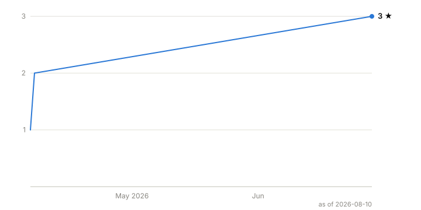

# Awesome Multi-Agent Systems [](https://awesome.re)


[](LICENSE)
[](https://github.com/bloo-mind/awesome-multi-agent-systems/actions/workflows/link-check.yml)


Autonomous agents that cooperate, compete, negotiate, and learn — a curated, **annotated** guide to Multi-Agent Systems (MAS), from classical coordination theory and multi-agent reinforcement learning (MARL) to LLM-based agent teams. Every entry says what it is, why it matters, and when to use it.

**Start here:** [The essential dozen](#start-here-the-essential-dozen) · [Which framework should I use?](#which-framework-should-i-use) · [Find a benchmark](#datasets-and-benchmarks) · [Understand failure modes](#recent-high-impact-papers-and-surveys) · [Wire up agent protocols](#agent-interoperability-protocols)

**Something missing?** [Suggest a resource in two minutes](https://github.com/bloo-mind/awesome-multi-agent-systems/issues/new/choose) — or grab a [help-wanted task](https://github.com/bloo-mind/awesome-multi-agent-systems/issues?q=is%3Aissue+is%3Aopen+label%3A%22good+first+issue%22).

## Contents

- [Awesome Multi-Agent Systems ](#awesome-multi-agent-systems-)
  - [Contents](#contents)
  - [Start here: the essential dozen](#start-here-the-essential-dozen)
  - [Getting started: three pathways](#getting-started-three-pathways)
  - [Explore by topic](#explore-by-topic)
  - [Curated resources](#curated-resources)
    - [Classic books (pre-2024)](#classic-books-pre-2024)
    - [Recent books (2024–)](#recent-books-2024)
    - [Tutorials and courses](#tutorials-and-courses)
    - [How-to guides and framework docs](#how-to-guides-and-framework-docs)
    - [Seminal papers and milestone work](#seminal-papers-and-milestone-work)
    - [Recent high-impact papers and surveys](#recent-high-impact-papers-and-surveys)
    - [Datasets and benchmarks](#datasets-and-benchmarks)
    - [Frameworks, libraries, and tools](#frameworks-libraries-and-tools)
      - [Which framework should I use?](#which-framework-should-i-use)
      - [LLM-based multi-agent frameworks](#llm-based-multi-agent-frameworks)
      - [MARL, simulation, and classic MAS platforms](#marl-simulation-and-classic-mas-platforms)
    - [Competitions and challenges](#competitions-and-challenges)
    - [Agent interoperability protocols](#agent-interoperability-protocols)
  - [Reproducibility and community](#reproducibility-and-community)
    - [Reproducibility resources and code](#reproducibility-resources-and-code)
    - [Community resources](#community-resources)
  - [Field guide: taxonomy and milestone timeline](#field-guide-taxonomy-and-milestone-timeline)
    - [MAS topic taxonomy](#mas-topic-taxonomy)
    - [Milestone timeline](#milestone-timeline)
  - [Recently added](#recently-added)
  - [Editorial policy](#editorial-policy)
  - [Related awesome lists](#related-awesome-lists)
  - [Contribution guidelines and curation criteria](#contribution-guidelines-and-curation-criteria)
    - [Contribution guidelines](#contribution-guidelines)
    - [Curation criteria](#curation-criteria)
  - [📑 Citation](#-citation)

## Start here: the essential dozen

If you only look at twelve things, make it these:

| If you want to… | Start with | Why |
|---|---|---|
| Understand agents from first principles | [An Introduction to MultiAgent Systems](#classic-books-pre-2024) | The canonical MAS textbook |
| Connect MAS to game theory | [Shoham & Leyton-Brown](#classic-books-pre-2024) | Free online; the algorithmic/game-theoretic foundations |
| Learn MARL properly | [MARL: Foundations and Modern Approaches](#recent-books-2024) | Free modern textbook with code and slides |
| Run reproducible MARL experiments | [PettingZoo](#marl-simulation-and-classic-mas-platforms) + [BenchMARL](#marl-simulation-and-classic-mas-platforms) | Standard environment API + standardised benchmarking pipeline |
| Beat a hard cooperative benchmark | [SMACv2](#datasets-and-benchmarks) | The de-facto cooperative MARL challenge, randomised to resist overfitting |
| Evaluate social generalisation | [Melting Pot](#datasets-and-benchmarks) | Tests generalisation to new co-players, not just new tasks |
| Map the LLM multi-agent space | [Guo et al. survey](#recent-high-impact-papers-and-surveys) | The most practical overview of methods and open problems |
| Build an LLM agent team | [Framework comparison](#which-framework-should-i-use) | Pick by use case, not by star count |
| Learn from a production system | [Anthropic's multi-agent research system](#how-to-guides-and-framework-docs) | Candid engineering retrospective: when multi-agent beats single-agent |
| Know why agent teams fail | [Why Do Multi-Agent LLM Systems Fail?](#recent-high-impact-papers-and-surveys) | Empirical failure taxonomy — read before shipping |
| Connect agents to tools and data | [Model Context Protocol (MCP)](#agent-interoperability-protocols) | The industry-standard tool/context interface |
| Make agents talk across frameworks | [Agent2Agent Protocol (A2A)](#agent-interoperability-protocols) | Cross-framework agent-to-agent communication |

## Getting started: three pathways

Different readers need different entry points. Pick the pathway that matches you:

**🎓 New to MAS research** — start with Wooldridge's [An Introduction to MultiAgent Systems](#classic-books-pre-2024), then the [seminal papers](#seminal-papers-and-milestone-work) (Contract Net → BDI → Dec-POMDP complexity), and browse the [taxonomy](#field-guide-taxonomy-and-milestone-timeline) to find your subfield.

**🤖 MARL practitioner** — the [MARL book](#recent-books-2024) (free online) for foundations; [PettingZoo + BenchMARL](#marl-simulation-and-classic-mas-platforms) to run reproducible experiments; [SMACv2 and Melting Pot](#datasets-and-benchmarks) as benchmarks; MAPPO as the baseline to beat.

**🧠 LLM-agent builder** — start with the [Guo et al. survey](#recent-high-impact-papers-and-surveys) for the map, pick an orchestration framework from the [comparison table](#which-framework-should-i-use), wire up tools/communication via the [MCP and A2A protocols](#agent-interoperability-protocols), and read [Why Do Multi-Agent LLM Systems Fail?](#recent-high-impact-papers-and-surveys) before shipping.

## Explore by topic

The collection is organised by resource type below, but most readers arrive with a problem. Jump by topic:

- **Coordination and negotiation** — [seminal papers](#seminal-papers-and-milestone-work) (Contract Net, ADOPT, Max-Sum), [NegMAS](#marl-simulation-and-classic-mas-platforms), [ANAC/SCML competitions](#competitions-and-challenges).
- **Multi-agent reinforcement learning (MARL)** — [recent papers](#recent-high-impact-papers-and-surveys) (MAPPO, SMACv2, BenchMARL), [benchmarks](#datasets-and-benchmarks), [MARL platforms](#marl-simulation-and-classic-mas-platforms), the [MARL book](#recent-books-2024).
- **LLM agent teams and orchestration** — [framework comparison](#which-framework-should-i-use), [how-to guides](#how-to-guides-and-framework-docs), [recent papers](#recent-high-impact-papers-and-surveys) (AutoGen, MetaGPT, CAMEL, Generative Agents, Magentic-One).
- **Evaluation and failure modes** — [AgentBench and successors](#recent-high-impact-papers-and-surveys), [Why Do Multi-Agent LLM Systems Fail?](#recent-high-impact-papers-and-surveys), [reproducibility resources](#reproducibility-resources-and-code).
- **Simulation and robotics** — [VMAS](#marl-simulation-and-classic-mas-platforms), [Mesa/NetLogo/GAMA (ABM)](#marl-simulation-and-classic-mas-platforms), [RoboCup leagues](#competitions-and-challenges).
- **Planning and path finding (MAPF)** — [MAPF survey](#recent-high-impact-papers-and-surveys), [League of Robot Runners](#competitions-and-challenges), [MAPF community portal](#community-resources).
- **Interoperability protocols** — [MCP, A2A, AG-UI, ANP](#agent-interoperability-protocols) and the [protocol surveys](#recent-high-impact-papers-and-surveys).
- **Game theory and mechanism design** — [Shoham & Leyton-Brown](#classic-books-pre-2024), [Stanford CS 224M](#tutorials-and-courses), [OpenSpiel](#marl-simulation-and-classic-mas-platforms).

## Curated resources

Two-tier curation: **milestones** (foundational, field-shaping work) and **recent** (2021–2026, emphasising benchmarks, reproducibility, and LLM-based multi-agent systems). Entries follow the format `Title — (Year) Authors · annotation · tags`; anything not verifiable from a primary source is marked **unspecified**. Star counts are live badges via [shields.io](https://shields.io/).

### Classic books (pre-2024)

- [**An Introduction to MultiAgent Systems** (2nd ed.)](https://www.cs.ox.ac.uk/people/michael.wooldridge/pubs/imas//IMAS2e.html) - (2009) by Michael Wooldridge
  A widely used MAS textbook covering agent concepts, interaction, coordination, and foundational theory; a solid "first principles" entry point for the broader MAS canon beyond MARL. `foundations`, `agents`, `coordination`.

- [**Multiagent Systems: Algorithmic, Game-Theoretic, and Logical Foundations**](http://www.masfoundations.org/) - (2009) by Yoav Shoham, Kevin Leyton-Brown
  Core reference connecting MAS with game theory, mechanism design, and computational foundations; also supported by a freely accessible "rough version" linked from a canonical course page. `game-theory`, `mechanism-design`, `foundations`.

- [**Multi-Agent Systems: A Modern Approach to Distributed Artificial Intelligence**](https://mitpress.mit.edu/9780262731317/multi-agent-systems/) - (1999) by Gerhard Weiss (editor)
  Classic edited volume spanning early MAS themes (coordination, communication, architectures) from distributed AI roots; useful for historical depth and breadth. `distributed-ai`, `foundations`, `architectures`.


### Recent books (2024–)

- [**Multi-Agent Systems: A Contemporary Treatment**](https://books.bloo-mind.ai/masact/) - (2026) by Dell Zhang, Jun Wang, Benjamin Chang
  A working draft textbook teaching the concepts and techniques of multi-agent systems in the era of LLMs; freely readable online. *Maintainer-affiliated* — see the [editorial policy](#editorial-policy). `textbook`, `LLM-agents`, `foundations`.

- [**Agents and Multi-Agent Systems Development: Platforms, Toolkits, Technologies**](https://link.springer.com/book/10.1007/978-3-032-01082-7) - (2026) by R. Collier, V. Mascardi, A. Ricci (editors)
  A snapshot of the current state of the art in tools, frameworks, and techniques for designing and implementing multi-agent systems; includes a chapter on "Agent Toolkits Anno 2025." `MAS-engineering`, `platforms`, `toolkits`.

- [**Design Multi-Agent AI Systems Using MCP and A2A**](https://www.packtpub.com/en-sg/product/design-multi-agent-ai-systems-using-mcp-and-a2a-9781806116461) - (2026) by Gigi Sayfan
  Hands-on guide to building a production-ready multi-agent AI framework from scratch in Python; covers tool use, memory via MCP, collaborative agent workflows with A2A, observability, and human-in-the-loop patterns. Companion code on GitHub. `LLM-agents`, `MCP`, `A2A`, `practice`.

- [**Agentic AI: Theories and Practices**](https://link.springer.com/book/10.1007/978-3-031-90026-6) - (2025) by Ken Huang (editor)
  Analyses the rise of generative AI agents (agentic AI) across industries, covering development, applications, and implications from finance to healthcare. `agentic-ai`, `LLM-agents`, `applications`.

- [**AI Agents in Action**](https://www.manning.com/books/ai-agents-in-action) - (2025) by Micheal Lanham
  Practitioner guide to building multi-agent AI systems using modern frameworks (LangChain, AutoGen, CrewAI); covers knowledge management, memory systems, and collaborative multi-agent architectures. `LLM-agents`, `multi-agent`, `practice`.

- [**Building Applications with AI Agents**](https://www.oreilly.com/library/view/building-applications-with/9781098176495/) - (2025) by Michael Albada
  A practical, research-based approach to designing and implementing single- and multi-agent systems, covering coordination techniques and communication methods for agent systems. `LLM-agents`, `multi-agent`, `practice`.

- [**Designing Multi-Agent Systems: Principles, Patterns, and Implementation for AI Agents**](https://multiagentbook.com/) - (2025) by Victor Dibia
  A first-principles guide to designing multi-agent applications, walking through building a feature-complete framework from scratch; by a core AutoGen contributor at Microsoft Research. Companion code on GitHub. `LLM-agents`, `multi-agent`, `practice`.

- [**Multi-Agent Reinforcement Learning: Foundations and Modern Approaches**](https://www.marl-book.com/) - (2024) by Stefano V. Albrecht, Filippos Christianos, Lukas Schäfer
  A modern MARL textbook focusing on models, solution concepts, algorithms, and practical challenges; associated with a companion website and learning materials (slides/code). `MARL`, `RL`, `game-theory`, `reproducibility`, `code`.


### Tutorials and courses

- [**European Agent Systems Summer School (EASSS)**](https://easss.upb.ro/) - (2025) by EURAMAS community
  Long-running summer school (since 1999) offering introductory and advanced courses across autonomous agents and MAS, aimed at researchers and students. `community`, `tutorials`, `foundations`.

- [**AAMAS tutorials programme**](https://aamas2025.org/index.php/conference/program/tutorials/) - (2025) by AAMAS organisers
  Tutorials highlight evolving MAS topics; the official programme page provides titles/abstracts and can seed curated "learning pathways" each year. `community`, `tutorials`, `MAS`.

- [**Cooperative AI Summer School**](https://www.cooperativeai.com/summer-school/summer-school-2025) - (2025) by Cooperative AI community
  A summer school aimed at grounding participants in cooperative AI (overlapping with MAS/MARL, incentives, and human/agent cooperation). `cooperative-ai`, `MARL`, `incentives`.

- [AAMAS 2025 tutorial: **RL in Automated Negotiation (T1)**](https://github.com/yasserfarouk/aamas2025rlneg) - (2025) by Yasser Farouk
  A concrete tutorial artefact (slides/code) framing negotiation as a multi-agent RL problem; useful for bridging MAS negotiation and learning-based approaches. `negotiation`, `MARL`, `tutorial`.

- [Stanford **CS 224M: Multi Agent Systems**](https://web.stanford.edu/class/cs224m/) - (2014) by Stanford course staff; Instructor: Yoav Shoham
  A game-theory-and-mechanism-design-heavy MAS course page with structured readings, lecture materials via edX links, and a direct tie-in to the Shoham & Leyton-Brown textbook. `game-theory`, `mechanism-design`, `foundations`.


### How-to guides and framework docs

- [**How we built our multi-agent research system**](https://www.anthropic.com/engineering/built-multi-agent-research-system) - (2025) by Anthropic
  A widely read engineering retrospective on building a production orchestrator–worker multi-agent system: when multi-agent beats single-agent, prompt/tool design for delegation, and evaluation lessons. `LLM-agents`, `orchestration`, `engineering`.

- [**LangGraph documentation**](https://langchain-ai.github.io/langgraph/) - (2026) by LangChain/LangGraph maintainers
  README positions LangGraph for durable execution, memory, and human-in-the-loop agent workflows—useful for building multi-agent graphs. `LLM-agents`, `orchestration`, `graphs`.

- [**NegMAS tutorials**](https://negmas.readthedocs.io/en/latest/tutorials.html) - (2026) by NegMAS maintainers
  The repo links to tutorials and API references; also documents an ecosystem of competition frameworks and agents. `negotiation`, `how-to`, `simulation`.

- [**AutoGen documentation (multi-agent orchestration examples)**](https://microsoft.github.io/autogen/) - (2025) by Microsoft
  Includes code examples for multi-agent orchestration and notes on maintenance mode considerations for new users. `LLM-agents`, `orchestration`, `framework`.

- [**pyDCOP documentation**](https://pydcop.readthedocs.io/) - (2022) by Orange Open Source (archived)
  Despite archival status, the repo points to hosted documentation and provides a practical entry to DCOP modelling and algorithm experimentation. `DCOP`, `coordination`, `how-to`.


### Seminal papers and milestone work

- [**Decentralised Coordination of Continuously Valued Control Parameters using the Max-Sum Algorithm**](https://eprints.soton.ac.uk/267314/1/main-maxsumcont.pdf) - (2009) by Stranders et al.
  Demonstrates the Max-Sum message-passing approach for decentralised coordination via factor-graph representations, influential in MAS coordination and resource allocation formulations. `DCOP`, `message-passing`, `coordination`.

- [**ADOPT: Asynchronous Distributed Constraint Optimization with Quality Guarantees**](https://www.sciencedirect.com/science/article/pii/S0004370204001511) - (2005) by Modi et al.
  A key DCOP algorithm: asynchronous, parallel execution with guarantees on solution quality (optimality), strongly influencing DCOP as a MAS coordination formalism. `DCOP`, `coordination`, `optimization`.

- [**The Complexity of Decentralized Control of Markov Decision Processes**](https://pubsonline.informs.org/doi/abs/10.1287/moor.27.4.819.297) - (2002) by Bernstein et al.
  Formalises decentralised decision-making models and proves strong complexity results, grounding Dec-POMDP/DEC-MDP research in computational limits. `Dec-POMDP`, `planning`, `theory`.

- [**An agent-based approach for building complex software systems**](https://dl.acm.org/doi/10.1145/367211.367250) - (2001) by Nicholas R. Jennings
  A landmark argument for agent-based decomposition in complex software systems (autonomy, interaction, emergent system behaviour), shaping MAS engineering practice. `agent-oriented-software`, `engineering`.

- [**BDI Agents: From Theory to Practice**](https://cdn.aaai.org/ICMAS/1995/ICMAS95-042.pdf) - (1995) by Anand S. Rao, Michael P. Georgeff
  A classic bridge from formal BDI logics to implemented agent systems; foundational to deliberative agent architectures and practical rational agency discussions. `BDI`, `agent-architectures`, `foundations`.

- [**Agent-oriented programming**](https://www.sciencedirect.com/science/article/pii/0004370293900349) - (1993) by Yoav Shoham
  Establishes "agent-oriented programming" as a computational paradigm and helped catalyse agent-based approaches and mental-state abstractions in AI. `agent-architectures`, `foundations`.

- [**The Contract Net Protocol: High-Level Communication and Control in a Distributed Problem Solver**](https://dl.acm.org/doi/10.1109/TC.1980.1675516) - (1980) by Reid G. Smith
  Introduces a negotiation-inspired protocol for distributed task allocation—one of the earliest and most influential coordination mechanisms in distributed AI/MAS. `coordination`, `task-allocation`, `distributed-ai`.


### Recent high-impact papers and surveys

Items are chosen for (a) field-shaping benchmarks/tooling, (b) reproducibility/evaluation influence, or (c) representing a major new direction (e.g., LLM-based multi-agent systems).

- [**General AgentBench**](https://arxiv.org/html/2602.18998v1) - (2026) by Li et al.
  Introduces a unified benchmark framework for evaluating general LLM agents across search/coding/reasoning/tool-use; relevant for assessing generality claims. `LLM-agents`, `benchmark`, `evaluation`.

- [**The Orchestration of Multi-Agent Systems: Architectures, Protocols, and Enterprise Adoption**](https://arxiv.org/abs/2601.13671) - (2026) by Adimulam, Gupta, Kumar
  Discusses MCP and A2A as emerging standards for structured, interoperable multi-agent communication in enterprise settings. `protocols`, `orchestration`, `survey`.

- [**Evaluation and Benchmarking of LLM Agents: A Survey**](https://dl.acm.org/doi/10.1145/3711896.3736570) - (2025) by Mohammadi et al.
  A survey aiming to clarify the evaluation landscape for LLM agents; useful when designing benchmarks, metrics, and reporting practices. `LLM-agents`, `survey`, `evaluation`.

- [**LLM Multi-Agent Systems: Challenges and Open Problems**](https://arxiv.org/abs/2502.12668) - (2025) by Tran et al.
  Explicitly focuses on challenges/open problems for LLM multi-agent systems, helping turn "framework hacking" into research questions. `LLM-agents`, `multi-agent`, `survey`.

- [**Why Do Multi-Agent LLM Systems Fail?**](https://arxiv.org/abs/2503.13657) - (2025) by Cemri et al.
  Empirical taxonomy (MAST) of failure modes across popular multi-agent LLM frameworks—specification, inter-agent misalignment, and verification failures; essential reading before attributing gains to "more agents." `LLM-agents`, `failure-analysis`, `evaluation`.

- [**A Survey of Agent Interoperability Protocols: MCP, ACP, A2A, and ANP**](https://arxiv.org/abs/2505.02279) - (2025) by Ehtesham et al.
  Comparative survey of four emerging agent communication/interoperability protocols across architecture, transport, security, and deployment dimensions. `protocols`, `interoperability`, `survey`.

- [**Advancing Multi-Agent Systems Through Model Context Protocol**](https://arxiv.org/abs/2504.21030) - (2025) by Naveen Krishnan
  Examines MCP's role in MAS with case studies in enterprise knowledge management, collaborative research, and distributed problem-solving. `MCP`, `multi-agent`, `protocols`.

- [**BenchMARL: Benchmarking Multi-Agent Reinforcement Learning**](https://arxiv.org/abs/2312.01472) - (2024) by Bettini, Prorok, Moens
  A benchmarking/training pipeline focused on **standardised configuration and reproducible comparisons** across algorithms, environments, and models (TorchRL backend). `MARL`, `benchmarking`, `reproducibility`.

- [**MLE-bench: Evaluating Machine Learning Agents on ML Engineering**](https://arxiv.org/abs/2410.07095) - (2024) by Chan et al.
  Curates ML engineering tasks (from Kaggle competitions) to measure agent performance on real-world ML engineering workflows. `LLM-agents`, `benchmark`, `ML-engineering`.

- [**Magentic-One: A Generalist Multi-Agent System for Solving Complex Tasks**](https://arxiv.org/abs/2411.04468) - (2024) by Fourney et al.
  A generalist multi-agent architecture with an Orchestrator coordinating specialised agents (web/file/code) to complete complex tasks; a representative "agentic systems" direction. `LLM-agents`, `multi-agent`, `tool-use`.

- [**Large Language Model based Multi-Agents: A Survey of Progress and Challenges**](https://arxiv.org/abs/2402.01680) - (2024) by Guo et al.
  Aggregates methods, patterns, and open problems for LLM-based multi-agent systems; a practical map of a fast-moving space. `LLM-agents`, `multi-agent`, `survey`.

- [**Mixture-of-Agents Enhances Large Language Model Capabilities**](https://arxiv.org/abs/2406.04692) - (2024) by Wang et al.
  Shows layered ensembles of heterogeneous LLM agents iteratively refining each other's outputs can outperform single frontier models; a clean datapoint in the "do more agents help?" debate. `LLM-agents`, `ensembles`, `inference`.

- [**Generative Agents: Interactive Simulacra of Human Behavior**](https://arxiv.org/abs/2304.03442) - (2023) by Park et al.
  The "Smallville" paper: 25 LLM agents with memory, reflection, and planning produce believable emergent social behaviour; catalysed LLM-based agent simulation as a research direction. [Code](https://github.com/joonspk-research/generative_agents). `LLM-agents`, `simulation`, `social`.

- [**AutoGen: Enabling Next-Gen LLM Applications via Multi-Agent Conversation**](https://arxiv.org/abs/2308.08155) - (2023) by Wu et al.
  Frames multi-agent LLM applications as customisable conversations among agents (human, tool-using, LLM-backed); the paper behind the AutoGen framework. `LLM-agents`, `multi-agent`, `framework`.

- [**MetaGPT: Meta Programming for a Multi-Agent Collaborative Framework**](https://arxiv.org/abs/2308.00352) - (2023) by Hong et al.
  Encodes human SOPs (e.g., a software company's roles and artefacts) into LLM agent pipelines—"Code = SOP(Team)"; ICLR 2024 oral and one of the most-starred multi-agent projects. `LLM-agents`, `SOP`, `software-engineering`.

- [**CAMEL: Communicative Agents for "Mind" Exploration of Large Language Model Society**](https://arxiv.org/abs/2303.17760) - (2023) by Li et al.
  Introduces role-playing between cooperating LLM agents to study agent societies at scale and generate conversational data; seeded the CAMEL-AI ecosystem. `LLM-agents`, `role-playing`, `agent-societies`.

- [**MLAgentBench: Evaluating Language Agents on ML Experimentation**](https://arxiv.org/abs/2310.03302) - (2023–2024) by Huang et al.
  Focuses evaluation on agents performing end-to-end ML experimentation tasks; useful for connecting agentic systems to scientific workflows. `LLM-agents`, `benchmark`, `ML-engineering`.

- [**AgentBench: Evaluating LLMs as Agents**](https://arxiv.org/abs/2308.03688) - (2023) by Liu et al.
  A multi-dimensional benchmark of interactive environments to evaluate "LLM-as-agent" behaviour, helping structure evaluation beyond static QA. `LLM-agents`, `benchmark`, `evaluation`.

- [**Multi-Agent Reinforcement Learning: Foundations and Modern Approaches**](https://arxiv.org/abs/2306.08502) - (2023) by Wang et al.
  A broad MARL survey spanning foundations, algorithms, and challenges; good for "state of the field" grounding alongside textbooks. `MARL`, `survey`, `foundations`.

- [**MARLlib: A Scalable and Efficient Multi-agent RL Library**](https://www.jmlr.org/papers/volume24/23-0378/23-0378.pdf) - (2022–2023) by Hu et al.
  Standardises MARL training across tasks/algorithms via wrappers + policy mapping; positioned as a scalable library building on Ray/RLlib infrastructure. `MARL`, `library`, `reproducibility`.

- [**Melting Pot 2.0**](https://arxiv.org/abs/2211.13746) - (2022) by Agapiou et al.
  Expands and revises Melting Pot, including more scenarios and details intended as a sustained reference for future work using the Melting Pot protocol. `MARL`, `evaluation`, `social`.

- [**SMACv2: A New Benchmark for Cooperative Multi-Agent RL**](https://arxiv.org/abs/2212.07489) - (2022) by Ellis et al.
  Updates the StarCraft cooperative benchmark to address "solved" aspects of SMAC via added randomisation and diversity; widely used for evaluating cooperative MARL scalability and robustness. `MARL`, `benchmark`, `StarCraft`.

- [**VMAS: A Vectorized Multi-Agent Simulator for Collective Robot Learning**](https://arxiv.org/abs/2207.03530) - (2022) by Bettini et al.
  Provides a vectorised, differentiable multi-agent simulator for scalable multi-robot MARL benchmarking; targets high-throughput training and multi-robot scenarios. `robotics`, `simulation`, `MARL`.

- [**Problem Compilation for Multi-Agent Path Finding: a Survey**](https://www.ijcai.org/proceedings/2022/0783) - (2022) by Pavel Surynek
  A survey view of MAPF research directions and problem formulations; useful for MAS planning/coordination beyond learning-based methods. `planning`, `MAPF`, `survey`.

- [**The Surprising Effectiveness of PPO in Cooperative, Multi-Agent Games**](https://arxiv.org/abs/2103.01955) - (2021) by Yu et al.
  Reassesses on-policy PPO in cooperative MARL and popularises MAPPO-style baselines; widely used as a strong, practical reference point for cooperative MARL comparisons. `MARL`, `CTDE`, `baselines`.

- [**Scalable Evaluation of Multi-Agent Reinforcement Learning with Melting Pot**](https://arxiv.org/abs/2107.06857) - (2021) by Leibo et al.
  Proposes **Melting Pot** as an evaluation suite emphasising generalisation to new social partners and social scenarios, broadening MARL evaluation beyond narrow task overfitting. `MARL`, `evaluation`, `social`.


### Datasets and benchmarks

- [**OpenSpiel**](https://arxiv.org/abs/1908.09453) - (2019–) by DeepMind
  A widely used suite of games for reinforcement learning and game-theoretic research (C++/Python); link is the framework paper, repo listed under Frameworks. `game-theory`, `RL`, `benchmark`.

- [**PettingZoo environments**](https://pettingzoo.farama.org/) - (2020–) by Farama Foundation
  A standardised Python API + environment collection for MARL; paired with an academic paper describing the API model (AEC) and design choices. Repo listed under Frameworks. `MARL`, `benchmarks`, `simulation`.

- [**Multi-Agent Particle Environment (MPE)**](https://github.com/openai/multiagent-particle-envs) - (2017) by OpenAI (archived)
  Classic particle-world MARL environment used in multiple seminal MARL/communication papers; archived "as-is" and the repo points to maintained variants in PettingZoo. `MARL`, `continuous`, `benchmark` · 

- [**Overcooked-AI**](https://github.com/HumanCompatibleAI/overcooked_ai) - (2019–) by HumanCompatibleAI
  Benchmark environment for cooperative coordination (human-AI and AI-AI); includes data links and references to research using the environment. `cooperation`, `human-ai`, `coordination` · 

- [**Melting Pot**](https://github.com/google-deepmind/meltingpot) - (2021–) by DeepMind
  Multi-agent evaluation suite focused on social interactions and generalisation; repo includes evaluation tooling and documentation. `MARL`, `social`, `evaluation` · 

- [**Hanabi Learning Environment**](https://github.com/google-deepmind/hanabi-learning-environment) - (2018–2024) by DeepMind (archived)
  Research platform implementing the cooperative game Hanabi as an RL environment; repo is archived (read-only) as of 2024-04-18. For current use, the actively maintained [OpenSpiel](#marl-simulation-and-classic-mas-platforms) includes Hanabi among its games. `cooperative`, `partial-obs`, `benchmark` · 

- [**MAgent2**](https://github.com/Farama-Foundation/MAgent2) - (2020–) by Farama Foundation
  Engine for gridworld-like many-agent environments; positioned as maintained fork + separate home for earlier PettingZoo environments. `many-agents`, `simulation`, `MARL` · 

- [**SMACv2**](https://github.com/oxwhirl/smacv2) - (2022–) by WhiRL / Oxford
  Cooperative MARL benchmark in StarCraft II micromanagement scenarios; designed to be API-compatible with SMAC while adding more challenging diversity. Code is stable but dormant (no commits since Feb 2024), while remaining the reference cooperative benchmark in the literature. `MARL`, `StarCraft`, `benchmark` · 

- [**SMAC (original)**](https://github.com/oxwhirl/smac) - (2019–) by WhiRL / Oxford
  Predecessor benchmark, dormant since Feb 2024; useful for historical consistency with older baselines and for papers reporting SMAC results. `MARL`, `StarCraft`, `benchmark`.


### Frameworks, libraries, and tools

Framework selection is often the biggest "time sink" decision in MAS work. Start with the comparison below, then use the full lists for language, license, adoption, and maturity signals.

#### Which framework should I use?

An opinionated shortlist of the eight most consequential LLM multi-agent frameworks (verified July 2026). Adoption is one signal; "best for" and "caveat" matter more.

| Framework | Best for | Coordination model | Language | MCP / A2A | Caveat |
|---|---|---|---|---|---|
| [LangGraph](https://github.com/langchain-ai/langgraph) | Stateful, long-running production workflows | Graph / state machine | Python, JS | MCP (adapters) | General orchestration tool, not a MAS research platform |
| [Microsoft Agent Framework](https://github.com/microsoft/agent-framework) | Production agent workflows on Python/.NET/Azure | Graph workflows + group chat | Python, .NET | MCP + A2A | Young — APIs still stabilising after the AutoGen/Semantic Kernel merger |
| [AutoGen](https://github.com/microsoft/autogen) | Conversational multi-agent research | Event-driven agent conversations | Python, .NET | MCP | Maintenance mode; new projects are pointed to Agent Framework |
| [CrewAI](https://github.com/crewAIInc/crewAI) | Role-based business process automation | Crews (roles/tasks) + Flows | Python | MCP + A2A (native) | High-level abstractions can constrain fine-grained control |
| [OpenAI Agents SDK](https://github.com/openai/openai-agents-python) | Lightweight production handoff pipelines | Handoffs + guardrails | Python | MCP | OpenAI-centric defaults; other model providers via LiteLLM |
| [Google ADK](https://github.com/google/adk-python) | Code-first agents in the Google ecosystem | Hierarchical / workflow agents | Python, Go, TS, Java | MCP + A2A | Strongest inside the Gemini/Vertex AI ecosystem |
| [MetaGPT](https://github.com/FoundationAgents/MetaGPT) | SOP-driven software-team simulation | Role pipeline ("Code = SOP(Team)") | Python | unspecified[^metagpt-protocols] | Research-oriented; less general beyond software-engineering tasks |
| [CAMEL](https://github.com/camel-ai/camel) | Studying agent societies and synthetic data | Role-playing dialogue | Python | MCP | Research-first; not a production orchestration layer |

[^metagpt-protocols]: No MCP or A2A integration is documented in MetaGPT's [official repository](https://github.com/FoundationAgents/MetaGPT) or [official documentation](https://docs.deepwisdom.ai/) as of 19 July 2026, so the protocol field remains conservatively unspecified.

For MARL training and classic MAS platforms (PettingZoo, BenchMARL, Jason, NegMAS, …), see the [second list](#marl-simulation-and-classic-mas-platforms).

#### LLM-based multi-agent frameworks

- [**AutoGen**](https://github.com/microsoft/autogen) - Python · MIT (code) + CC-BY-4.0 (docs) · Maintenance mode (succeeded by Microsoft Agent Framework)
  Multi-agent LLM application framework. 

- [**Microsoft Agent Framework**](https://github.com/microsoft/agent-framework) - Python/.NET · MIT · Active
  Unified multi-agent framework merging AutoGen + Semantic Kernel; graph-based workflows, multi-LLM, OpenTelemetry. 

- [**MetaGPT**](https://github.com/FoundationAgents/MetaGPT) - Python · MIT · Active
  Multi-agent framework encoding software-company SOPs into role-based LLM agent pipelines; among the most-starred multi-agent projects. 

- [**CrewAI**](https://github.com/crewAIInc/crewAI) - Python · MIT · Mature/active (industry-oriented)
  Multi-agent workflow orchestration; native MCP and A2A support. 

- [**LangGraph**](https://github.com/langchain-ai/langgraph) - Python · MIT · Mature/active
  Graph-based orchestration for long-running/stateful agents. 

- [**CAMEL**](https://github.com/camel-ai/camel) - Python · Apache-2.0 · Active (research)
  Framework for building and studying agent societies (role-playing, communication, synthetic data generation); anchors the CAMEL-AI research community. 

- [**ChatDev**](https://github.com/OpenBMB/ChatDev) - Python · Apache-2.0 · Active (research)
  "Virtual software company" of communicative agents collaborating via chat chains; a widely cited LLM multi-agent collaboration testbed. 

- [**Swarm**](https://github.com/openai/swarm) - Python · MIT · Experimental/educational
  Lightweight educational framework for multi-agent orchestration (handoffs/tools). 

- [**OpenAI Agents SDK**](https://github.com/openai/openai-agents-python) - Python · MIT · Active
  Production multi-agent orchestration with handoffs, guardrails, tracing; successor to Swarm. 

- [**Google ADK**](https://github.com/google/adk-python) - Python/Go/TS/Java · Apache-2.0 · Active
  Code-first toolkit for building, evaluating, and deploying AI agents; MCP tool support. 

- [**Claude Agent SDK**](https://github.com/anthropics/claude-agent-sdk-python) - Python · MIT · Active
  SDK exposing the agent harness behind Claude Code (tools, subagents, hooks, MCP) for building custom agents. 

- [**smolagents**](https://github.com/huggingface/smolagents) - Python · Apache-2.0 · Active
  Minimal, code-first agent library from Hugging Face; supports hierarchical multi-agent setups with managed agents. 

- [**AgentScope**](https://github.com/agentscope-ai/agentscope) - Python · Apache-2.0 · Active
  Message-passing multi-agent framework (from Alibaba) with distributed execution and AgentScope Studio tooling. 

- [**Orkas**](https://github.com/Orkas-AI/Orkas) - TypeScript · MIT · Active
  Local-first desktop tool where a Commander coordinates specialist agents in parallel or sequence. *Contributor-affiliated.* 

- [**AgentVerse**](https://github.com/OpenBMB/AgentVerse) - Python · Apache-2.0 · Research
  Framework for both task-solving and social-simulation multi-agent environments (classroom, prisoner's dilemma, software design). 

- [**Concordia**](https://github.com/google-deepmind/concordia) - Python · Apache-2.0 · Active (research)
  DeepMind library for generative agent-based modelling of social interaction—bridges LLM agents and the ABM tradition. 

#### MARL, simulation, and classic MAS platforms

- [**Ray**](https://github.com/ray-project/ray) - (incl. RLlib) — Python/C++ · Apache-2.0 · Production/active
  Distributed RL training; practical multi-agent RL at scale. 

- [**OpenSpiel**](https://github.com/google-deepmind/open_spiel) - C++/Python · Apache-2.0 · Mature/active
  Games for RL + game theory research. 

- [**Mesa**](https://github.com/projectmesa/mesa) - Python · Apache-2.0 · Mature/active
  Agent-based modelling (ABM) in Python; JOSS paper for Mesa 3 (2025). 

- [**PettingZoo**](https://github.com/Farama-Foundation/PettingZoo) - Python · MIT · Mature/active
  Standardised MARL environments + API. 

- [**TorchRL**](https://github.com/pytorch/rl) - Python · MIT · Active; "beta" disclaimer
  RL library (includes MARL-relevant utilities; used by BenchMARL/VMAS). 

- [**PyMARL**](https://github.com/oxwhirl/pymarl) - Python · Apache-2.0 · Mature (research)
  Research codebase for cooperative MARL baselines. 

- [**MARLlib**](https://github.com/Replicable-MARL/MARLlib) - Python/C++ · MIT · Mature (research)
  Unified MARL training across tasks/algorithms (built on Ray/RLlib). 

- [**NetLogo**](https://github.com/NetLogo/NetLogo) - Scala/Java · GPL-2.0 · Mature/active
  ABM language + modelling environment (strong education + research footprint). 

- [**BenchMARL**](https://github.com/facebookresearch/BenchMARL) - Python · MIT · Active (research)
  Standardised MARL benchmarking + reporting pipeline. 

- [**VMAS**](https://github.com/proroklab/VectorizedMultiAgentSimulator) - Python · GPL-3.0 · Active (research)
  Vectorised multi-agent robotics simulation for MARL benchmarking. 

- [**SPADE**](https://github.com/javipalanca/spade) - Python · MIT · Active (niche)
  XMPP-based multi-agent platform. 

- [**Jason**](https://github.com/jason-lang/jason) - Java · LGPL-3.0 · Active (niche)
  BDI/AgentSpeak interpreter and MAS platform. 

- [**MASON**](https://github.com/eclab/mason) - Java · View license · Mature (research/edu)
  Multi-agent simulation toolkit. 

- [**GAMA Platform**](https://github.com/gama-platform/gama) - Java · GPL-3.0 · Active (niche)
  Spatially explicit ABM simulation environment. 

- [**NegMAS**](https://github.com/yasserfarouk/negmas) - Python · BSD-3-Clause · Active (niche)
  Automated negotiation library + ecosystem (ANL/SCML agents, bridges). 

- [**Jadex**](https://github.com/actoron/jadex) - Java · GPL-3.0 · Niche/low activity
  BDI agent platform. 

- [**pyDCOP**](https://github.com/Orange-OpenSource/pyDCOP) - Python · BSD-3-Clause · Archived (2022-10-20)
  DCOP algorithms + experimentation tooling. 


### Competitions and challenges

- [**ANAC leagues listing (ANL, SCML)**](https://scml.cs.brown.edu/) - (2026) by Brown University site
  Shows the league structure (Automated Negotiation League; Supply Chain Management League) for ANAC 2026. `negotiation`, `benchmark`.

- [**Hanabi Challenge**](https://research.google/pubs/the-hanabi-challenge-a-new-frontier-for-ai-research/) - (2020–) by Google Research / community
  A cooperative imperfect-information game used as an AI challenge; the paper introduces an open-source learning environment and evaluation framing. `cooperation`, `communication`, `benchmark`.

- [**Automated Negotiating Agents Competition (ANAC)**](https://scml.cs.brown.edu/anac2025) - (2010–) by ANAC organisers
  Tournament series for benchmarking automated negotiation strategies; ANAC 2025 page summarises aims and positioning as a practical benchmark. `negotiation`, `competition`, `benchmark`.

- [**RoboCup Soccer Simulation League**](https://www.robocup.org/leagues/23) - (ongoing) by RoboCup
  Multi-agent team strategy competition in a simulated soccer environment; official page highlights "independently moving software players (agents)". `robotics`, `multi-agent`, `competition`.

- [**League of Robot Runners (MAPF competition)**](https://github.com/MAPF-Competition/Code-Archive) - (ongoing) by MAPF-Competition
  Competition solution archive intended to lower barrier of entry and support reproducibility for MAPF. `MAPF`, `planning`, `competition`.

- [**RoboCup Rescue Simulation "Agent Simulation"**](https://rescuesim.robocup.org/research/publications/agent-competition/) - (ongoing) by RoboCup Rescue Simulation
  "Agent Simulation" competition track with publications list curated by organisers; useful for multi-agent disaster response and coordination research context. `robotics`, `simulation`, `coordination`.

- [**Supply Chain Management League (SCML)**](https://scml.cs.brown.edu/scml) - (unspecified) by SCML organisers
  A negotiation-centric simulation: build an agent negotiating trades for a factory manager in a supply chain setting. `negotiation`, `simulation`, `markets`.

- [**Multi-Agent Programming Contest (MAPC)**](https://multiagentcontest.org/) - (unspecified) by MAPC organisers
  Long-running contest emphasising engineering of MAS that coordinate in a shared environment (often used in agent programming education/research). `MAS-engineering`, `coordination`, `competition`.


### Agent interoperability protocols

A fast-emerging layer in LLM-based multi-agent systems: open protocols standardising how agents connect to tools, communicate with each other, and interact with users. Governance is converging under the **Agentic AI Foundation (AAIF)**, a Linux Foundation directed fund co-founded by Anthropic, Block, Google, Microsoft, and OpenAI (formed December 2025).

- [**Model Context Protocol (MCP)**](https://github.com/modelcontextprotocol) - Tool/context access · Anthropic / AAIF (2024) · MIT
  An open standard providing a universal JSON-RPC interface for AI applications to connect to external tools, data sources, and services — "USB-C for AI." Adopted by OpenAI, Google, Microsoft, and 10,000+ production servers. Donated to the Linux Foundation (AAIF) in Dec 2025. [Spec](https://modelcontextprotocol.io) · 

- [**Agent2Agent Protocol (A2A)**](https://github.com/a2aproject/A2A) - Agent-to-agent · Google / AAIF (2025) · Apache-2.0
  An open protocol for cross-framework agent-to-agent communication: discovery via Agent Cards, task negotiation, and multimodal collaboration without exposing internal logic. 150+ partner organisations; donated to Linux Foundation in June 2025. Absorbed IBM's ACP. [Spec](https://a2a-protocol.org/latest/) · 

- [**AGENTS.md**](https://github.com/agentsmd/agents.md) - Agent instructions · OpenAI / AAIF (2025) · MIT
  A simple, open markdown convention providing AI coding agents with project-specific instructions (build commands, code style, testing rules); adopted by 60,000+ repositories and supported by all major AI coding tools. 

- [**AG-UI (Agent-User Interaction Protocol)**](https://github.com/ag-ui-protocol/ag-ui) - Agent-to-user · CopilotKit (2025) · MIT
  An open, event-based protocol standardising real-time bidirectional communication between AI agent backends and frontend applications; enables generative UI, state synchronisation, and human-in-the-loop collaboration. 

- [**Agent Network Protocol (ANP)**](https://github.com/agent-network-protocol/AgentNetworkProtocol) - Decentralised networking · ANP community (2024) · MIT
  A W3C-aligned protocol for decentralised agent identity, discovery, and communication using a three-layer architecture built on DIDs and Verifiable Credentials; aims to be the networking layer for the "Agentic Web." 


## Reproducibility and community

### Reproducibility resources and code

- [**NeurIPS Paper Checklist (reproducibility + transparency)**](https://neurips.cc/public/guides/PaperChecklist) - (2025) by NeurIPS
  The checklist is explicitly described as encouraging best practices for reproducibility, transparency, ethics, and societal impact, and is part of submission requirements. `reproducibility`, `reporting`, `community`.

- [**BenchMARL documentation**](https://benchmarl.readthedocs.io/) - (2024) by Facebook Research
  Explicitly designed around reproducibility and standardisation of MARL experiments; includes configuration discipline and benchmarking abstractions. `MARL`, `reproducibility`, `benchmarking`.

- [**MARLlib documentation**](https://marllib.readthedocs.io/) - (2022–2023) by Replicable-MARL
  Emphasises standardised wrappers and policy mapping to reduce compatibility friction; provides a codebase associated with both arXiv and JMLR versions. `MARL`, `reproducibility`, `library`.

- [**League of Robot Runners (official site)**](https://www.leagueofrobotrunners.org/) - (ongoing) by MAPF-Competition
  Reproducibility mechanism in a competition context (collects top implementations yearly) to help newcomers and facilitate comparisons. `MAPF`, `reproducibility`, `competition`.

- [**OpenReview**](https://openreview.net/about) - (ongoing) by OpenReview (nonprofit)
  A peer review + publishing infrastructure used by major ML venues; useful for reading reviews, comparing revisions, and tracking reproducibility discussions. `peer-review`, `reproducibility`, `community`.


### Community resources

- [**AAMAS conference**](https://cyprusconferences.org/aamas2026/) - (2026) by AAMAS organisers
  Flagship MAS venue; AAMAS 2026 dates are 25–29 May 2026 in Paphos, Cyprus. `conference`, `MAS`, `community`.

- [**Agentic AI Foundation (AAIF)**](https://aaif.io/) - (2025) by Linux Foundation
  Industry governance body for open agentic standards (stewards MCP, A2A, AGENTS.md); platinum members include AWS, Anthropic, Block, Google, Microsoft, and OpenAI. `standards`, `governance`, `LLM-agents`.

- [**EUMAS (European Conference on MAS)**](https://euramas.github.io/eumas2025/) - (2025) by EUMAS organisers
  European venue specifically focused on MAS research, complementary to broader AI conferences. `conference`, `MAS`.

- [**AAMAS workshops**](https://aamas2025.org/index.php/conference/program/accepted-workshops/) - (2025) by AAMAS organisers
  Workshops pages are useful for tracking subcommunity focus areas (emerging topics, nascent benchmarks). `workshops`, `community`.

- [**IFAAMAS (organising association)**](https://www.ifaamas.org/) - (ongoing) by IFAAMAS
  Association representing autonomous agents and MAS, distributing knowledge through conferences and related activities. `community`, `MAS`.

- [**EURAMAS**](https://sites.google.com/view/euramas/) - (ongoing) by European Association for Multi-Agent Systems
  Community hub for European MAS activities (EASSS, EUMAS, etc.). `community`, `Europe`, `MAS`.

- [**NetLogo community channels**](https://ccl.northwestern.edu/netlogo/) - (ongoing) by NetLogo maintainers
  The official NetLogo site points to a user group, forum, and a developer list (`netlogo-devel`), supporting community troubleshooting and extension. `ABM`, `simulation`, `community`.

- [**MAPF community portal**](https://mapf.info/) - (unspecified) by MAPF community
  Centralised MAPF info and materials; useful for MAS planning researchers and competition participants. `MAPF`, `planning`, `community`.


## Field guide: taxonomy and milestone timeline

### MAS topic taxonomy

```mermaid
graph TD
  MAS[Multi-Agent Systems] --> Models[Agent Models & Architectures]
  MAS --> Interaction[Interaction & Coordination]
  MAS --> Learning[Learning in Multi-Agent Settings]
  MAS --> Eval[Benchmarks, Evaluation, Reproducibility]
  MAS --> Simulation[Agent-Based Modelling & Simulation]

  Models --> BDI[BDI / deliberative agents]
  Models --> DecDP[Decentralised decision processes - Dec-POMDP/DEC-MDP]
  Interaction --> GameTheory[Game theory & mechanism design]
  Interaction --> Negotiation[Automated negotiation]
  Interaction --> DCOP[Distributed constraint optimisation - DCOP]
  Interaction --> MAPF[Multi-agent path finding]

  Learning --> MARL[Multi-Agent Reinforcement Learning]
  Learning --> Comm[Emergent communication / coordination learning]
  Learning --> LLM[LLM-based agents & multi-agent teams]

  MAS --> Protocols[Agent Interoperability Protocols]
  Protocols --> ToolProto[Tool/context protocols - MCP]
  Protocols --> A2AProto[Agent-to-agent protocols - A2A]
  Protocols --> UIProto[Agent-to-user protocols - AG-UI]

  Eval --> Bench[Benchmarks & task suites]
  Eval --> Artifacts[Artifacts, checklists, code release norms]
  Simulation --> ABM[ABM toolchains - social/eco/epi]
  Simulation --> RoboticsSim[Robotics-focused multi-agent simulation]
```



### Milestone timeline

```mermaid
timeline
  title MAS milestones (selected)
  1980 : Contract Net Protocol (task allocation/coordination)
  1993 : Agent-Oriented Programming
  1995 : BDI Agents (theory to practice)
  2001 : Agent-based software engineering (agent paradigm)
  2002 : Decentralised control complexity (Dec-POMDP/DEC-MDP)
  2005 : ADOPT (DCOP optimality + async execution)
  2009 : Max-Sum in decentralised coordination (factor graphs)
  2021 : MAPPO (strong cooperative MARL baseline)
  2021 : Melting Pot (social/generalisation evaluation)
  2022 : VMAS (vectorised multi-robot MARL sim)
  2022 : SMACv2 (harder cooperative MARL benchmark)
  2023 : Generative Agents (LLM agent societies)
  2023 : CAMEL / AutoGen / MetaGPT (LLM multi-agent frameworks)
  2023 : MARLlib (standardised MARL training library)
  2024 : BenchMARL (reproducible benchmarking pipeline)
  2024 : Magentic-One (generalist multi-agent LLM system)
  2024 : MCP - Model Context Protocol (tool/context interop standard)
  2025 : A2A - Agent2Agent Protocol (agent-to-agent interop standard)
  2025 : OpenAI Agents SDK / Google ADK (production multi-agent frameworks)
  2025 : Survey on evaluating/benchmarking LLM agents
  2026 : General AgentBench (unified LLM-agent evaluation)
```



## Recently added

Latest additions to the list — watch or star the repo to follow updates.

- *Jul 2026* — [Multi-Agent Systems: A Contemporary Treatment](#recent-books-2024) (textbook), the [framework comparison table](#which-framework-should-i-use), and this navigation refresh.
- *Jun 2026* — [Microsoft Agent Framework](#llm-based-multi-agent-frameworks), [How we built our multi-agent research system](#how-to-guides-and-framework-docs) (Anthropic), [General AgentBench](#recent-high-impact-papers-and-surveys), and five foundational LLM-agent papers (Generative Agents, AutoGen, MetaGPT, CAMEL, Mixture-of-Agents).

## Editorial policy

Curation quality depends on transparency. This list operates under the following rules:

- **Same bar for everyone.** Every entry — including maintainer-affiliated ones — must meet the [curation criteria](#curation-criteria): primary source, demonstrated impact or clear milestone status, and a neutral annotation.
- **Affiliations are disclosed.** Entries authored by or affiliated with list maintainers are explicitly marked *maintainer-affiliated* (currently one: [Multi-Agent Systems: A Contemporary Treatment](#recent-books-2024)). Independent challenges to any affiliated entry are welcome via issue or PR.
- **Removal is part of curation.** Entries are removed or flagged when links die without an official mirror, projects are archived without historical significance, or a resource is clearly superseded. Archived-but-historically-important resources (e.g., MPE, Hanabi Learning Environment, pyDCOP) stay listed with their archival status stated.
- **Maintainers:** [bloo-mind](https://github.com/bloo-mind) (lead: Dell Zhang). External co-maintainers from the classical MAS, MARL, and LLM-agent communities are actively welcomed — open an issue to volunteer.
- **Last full review:** July 2026. Framework metadata (language, license, maturity) is re-verified at each full review; dead links are caught weekly by CI.

## Related awesome lists

Complementary curated lists for adjacent communities:

- [**awesome-ai-agents**](https://github.com/e2b-dev/awesome-ai-agents) - Broad catalogue of AI agent products and projects (single- and multi-agent), maintained by E2B. 
- [**LLM-Agent-Paper-List**](https://github.com/WooooDyy/LLM-Agent-Paper-List) - Paper list accompanying *The Rise and Potential of LLM-Based Agents* survey. 
- [**LLM_MultiAgents_Survey_Papers**](https://github.com/taichengguo/LLM_MultiAgents_Survey_Papers) - Companion paper list to the Guo et al. LLM multi-agent survey. 
- [**MARL-Papers**](https://github.com/LantaoYu/MARL-Papers) - Long-running list of multi-agent reinforcement learning papers. 
- [**MARL-papers-with-code**](https://github.com/TimeBreaker/MARL-papers-with-code) - MARL papers filtered for available code. 

## Contribution guidelines and curation criteria

### Contribution guidelines

Three ways to contribute, from lightest to heaviest:

1. **Suggest a resource in two minutes** — fill in the [issue form](https://github.com/bloo-mind/awesome-multi-agent-systems/issues/new/choose); maintainers will verify and incorporate accepted suggestions, with credit.
2. **Verify or fix an entry** — dead links, changed maintenance status, wrong metadata; see [open tasks](https://github.com/bloo-mind/awesome-multi-agent-systems/issues?q=is%3Aissue+is%3Aopen+label%3A%22good+first+issue%22).
3. **Open a pull request** — see [CONTRIBUTING.md](CONTRIBUTING.md) for the entry template and checklist. Aim to keep entries **curated, not exhaustive**.

Recommended PR workflow:
1. Add a single item to the appropriate list (or propose a new subcategory if clearly necessary).
2. Ensure each entry includes all required metadata:
   - Title
   - Authors/Maintainers
   - Year (or `unspecified`)
   - Annotation (1–3 sentences; focus on significance and appropriate use)
   - Link (prefer official/publisher/proceedings/arXiv/GitHub)
   - Tags
3. For tools, include **language + license + maturity + stars** (or mark unknown values as `unspecified`).
4. Prefer one strong primary source over multiple secondary blog posts.

### Curation criteria

An entry is likely to be accepted if it satisfies most of:
- Primary/official source: original paper (arXiv/DOI/proceedings) or official repository/organisation page.
- Research relevance: directly informs MAS theory, algorithms, evaluation protocols, or reproducible tooling.
- Demonstrated impact: strong citations, adoption, or clear "milestone" status (historical shaping).
- Reproducibility: code, data, benchmarks, or explicit evaluation methodology where applicable.
- Clarity and neutrality: annotation states what it is good for, limitations, and typical use contexts.

---

## 📑 Citation

To cite this collection itself, use the metadata in [`CITATION.cff`](CITATION.cff) (GitHub's "Cite this repository" button), or:

```bibtex
@misc{zhang2026awesomemas,
  author       = {Zhang, Dell and Chang, Benjamin},
  title        = {Awesome Multi-Agent Systems: A Curated, Annotated List of
                  Resources for Multi-Agent Systems Research},
  year         = {2026},
  howpublished = {\url{https://github.com/bloo-mind/awesome-multi-agent-systems}}
}
```

This list is curated alongside the maintainers' textbook [*Multi-Agent Systems: A Contemporary Treatment* (MASACT)](https://books.bloo-mind.ai/masact/), which you can cite as the related publication:

```bibtex
@book{zhang2026masact,
  title  = {Multi-Agent Systems: A Contemporary Treatment},
  author = {Zhang, Dell and Wang, Jun and Chang, Benjamin},
  year   = {2026},
  note   = {Manuscript in progress, written in public},
  url    = {https://books.bloo-mind.ai/masact/}
}
```

---

<!-- ## Star History

<a href="https://github.com/bloo-mind/awesome-multi-agent-systems/stargazers"><picture>
  <source media="(prefers-color-scheme: dark)" srcset="assets/star-history-dark.svg">
  
</picture></a>

<sub>Regenerated weekly by [a scheduled workflow](.github/workflows/star-history.yml).</sub>

--- -->

<div align="center">

**If you find this page helpful, please give it a ⭐️ — starring also keeps updates in your GitHub feed.**

Made with ❤️ by [Bloo-Mind AI Ltd](https://www.bloo-mind.ai/).

</div>

<div align="center" style="margin-top: 10px;">
    <a href="https://www.bloo-mind.ai/"></a>
</div> 
